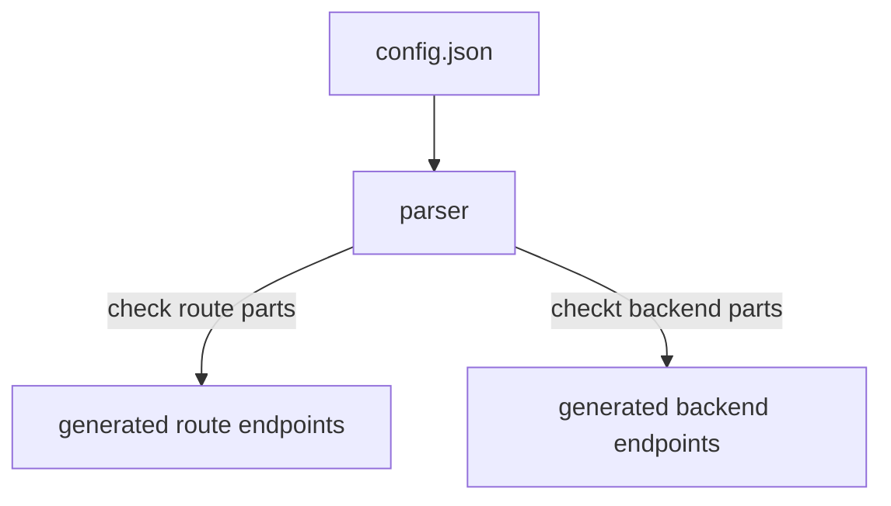
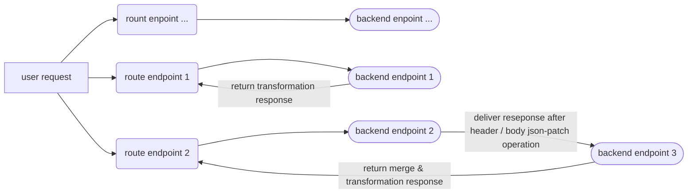

# fastapi-gateway

```mermaid
  graph TD;
      A[config.json]-->B[parser]
      B-->|check route parts|C[generated route endpoints]
      B-->|checkt backend parts|D[generated backend endpoints]
     
```

```mermaid
  graph LR;
      A[user request]-->B(route endpoint 1);
      A-->C(route endpoint 2);
      A-->G(rount enpoint ...);
      G-->H([backend enpoint ...]);
      B-->D([backend endpoint 1]);
      D-->|return transformation response|B
      C-->E([backend endpoint 2]);
      E-->|deliver reseponse after header / body json-patch operation|I([backend endpoint 3]);
      I-->|return merge & transformation response|C
```
