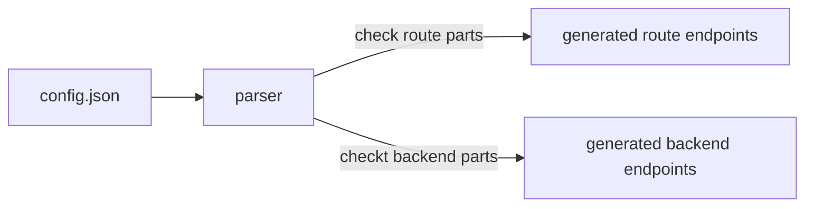
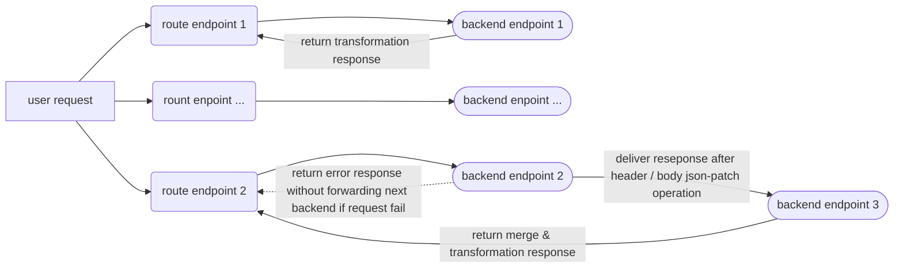

# fastapi-gateway

## config.json format

```json
{
  "port" : 80,
  "routes" : [
    "route" : "/",
    "backends": [
      {
        "url": "http://some-landing",
        "method": "GET",
        "header_json_patch" : [
          { "op": "add", "path": "/biscuits/1", "value": { "name": "Ginger Nut" } }
        ],
        "body_json_patch": [
          { "op": "test", "path": "/best_biscuit/name", "value": "Choco Leibniz" }
        ]
      }
    ]
  ]
}
```





## to-do
- check https://github.com/comeuplater/fastapi_cache for response caching
